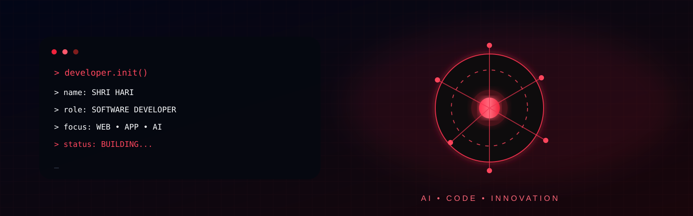

 

<h2 align="center">
  👨‍💻 ABOUT ME
</h2>

  

<b>AI&DS Student • Software Developer • Web • App • AI</b>

  

  

<code>Java</code>
&nbsp;•&nbsp;
<code>C</code>
&nbsp;•&nbsp;
<code>Python</code>
&nbsp;•&nbsp;
<code>Angular</code>
&nbsp;•&nbsp;
<code>JavaScript</code>
&nbsp;•&nbsp;
<code>AI</code>

  

<b>✦ A BETTER TOMORROW IS BUILT BY CODE ✦</b>

  

<code>BUILD • CREATE • INNOVATE</code>

<h2 align="center">📊 GITHUB STATS</h2>

  

<h2 align="center">🌐 CONNECT WITH ME</h2>

 

&nbsp;

  

<code>OPEN TO • COLLABORATION • PROJECTS • LEARNING</code>

  

<b>✦ LET'S BUILD SOMETHING GREAT ✦</b>

 

  

<b>✦ A BETTER TOMORROW IS BUILT BY CODE ✦</b>

 

<code>BUILD • CREATE • INNOVATE • REPEAT</code>

 

<h2 align="center">
  🌐 CONNECT WITH ME
</h2>

  

&nbsp;

<!-- Replace YOUR_EMAIL with your real email -->

  

<code>OPEN TO • COLLABORATION • LEARNING • INNOVATION</code>

  

<b>✦ LET'S BUILD SOMETHING GREAT ✦</b>

